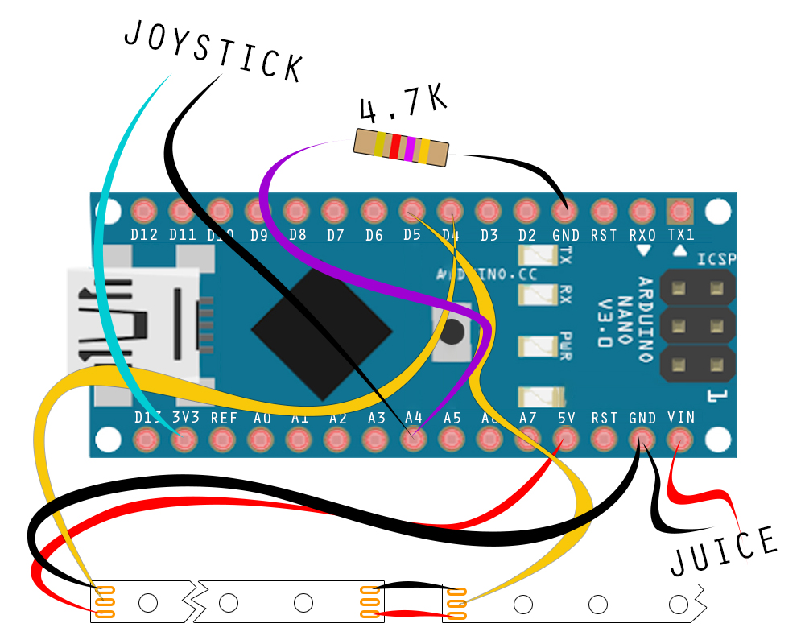

# fpv-led-thingie
If you want to fly your drone with LEDs and do some text light painting, this is for you. 

The idea is a stick with two LED-strips and an arduino that writes text to it. 

The version with joystick is intended for use with the common jystick that some FPV-cameras are shipped with.

It's a very simple code, and it could most likly be optimiezed and simplified if one was an Arduino-coder, and I'm not. :D

I used a 4.7k resistor, because thats what I had laying around, there are probably simple ways to calculate the buttons, but I just watched the serial monitor and picked numbers that worked. :)

